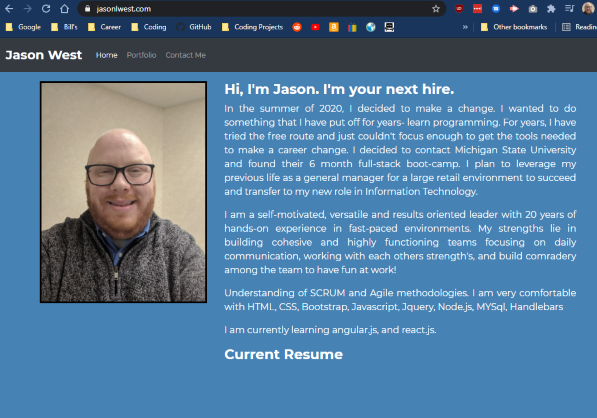

# Portfolio- Jason West 

Portfolio has been updated to reflect first full stack project and have added my front and back end projects to date.

The contact me page is back up. I am using the Twilio Send Grid that I used in Project 2 to email people. 

Colors have been updated to reflect my styling preferences.

Also, I have bought my own web page, jasonlwest.com

[Resume](https://github.com/jlw429/PortfolioHW2/blob/main/assets/Resume-%20Jason%20West.pdf)

[LinkedIn](https://www.linkedin.com/in/jasonlwest/)

## Screenshots

